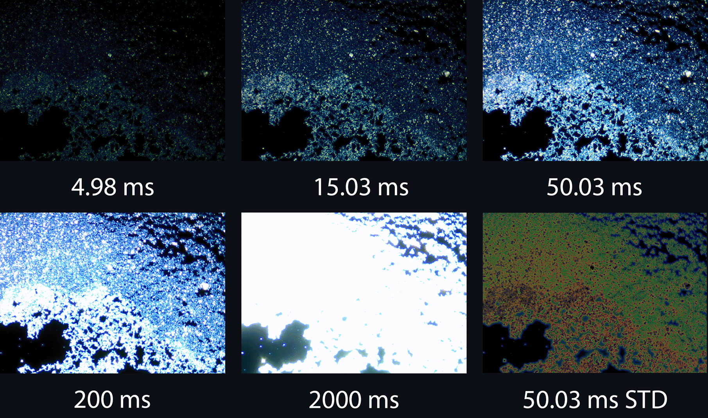

# camera_linearity

`camera_linearity` is an open-source Python package for analyzing the linearity of a digital camera based on a stack of differently exposed images of a static scene and solving the (inverse) camera response function. With a solved ICRF the package can also be used to linearize images and merge an exposure stack into a high dynamic range (HDR) image. If the user supplies dark field and flat field images, they can also apply corrections for bad pixels and fixed pattern artifacts. The package also includes a module for solving the ICRF of a given camera by utilizing the principal components of the response functions of a given data set. These PCs are used in an optimization process to find the ICRF, using the differential evolution solver in SciPy.

## License

`camera_linearity` depends on a number of third-party packages. These packages are  not distributed as part of this repository and are only listed in the `pipfile`. This package itself is licensed under MIT License. 

## Installation

`camera_linearity` is at the moment still work-in-progress. For now the package is available only on this GitHub repository. In time my aim is that the package will be made available on PyPi for install via `pip`.

## Example case

Below is a series of images captured using an Olympus SC100 CMOS camera, attached to an Olympus BX53M optical microscope, at 50x magnification in dark field mode. The sixth image shows an example of the uncertainty images. The sample shows a carbon nanotube deposition, formed on a silicon chip. The input images and uncertainty images are computed as mean stacks from a video, yielding minimally noisy input images and an empirical measure of the uncertainty of the input image. The input images are regular 8-bits per channel sRGB images, while the uncertainty images are 64-bits per channel RGB images.

  

This series of differently exposed images can be merged into a single HDR image with a solved ICRF for the camera. The resulting HDR image and its uncertainty are illustrated below via a false color image for each color channel, with the relative radiance in logarithmic scale and the associated uncertainty in linear scale. If the solved ICRF is sufficiently accurate to reality and the input images are not too noisy, the HDR merging produces quantitatively rather accurate maps of relative radiance. Such images can be used to measure and compare the relative radiance of parts of the same image and even parts of different images captured with the same camera.

  

## Usage

`camera_linearity` provides two main classes that can be used to manage image files and to analyze the linearity. These are the `ImageSet` and `ExposureSeries` objects. `ImageSet`class further is a composite of a `Measurand` class, which implement the mathematical and statistical functionality.

### `Measurand`

The `Measurand` class manages measurement data as NumPy or CuPy arrays. The class has the `.val` and `.std` attributes for managing measured data and its associated measurement uncertainty respectively. This class contains most of the mathematical and statistics functionality of the package.

### `ImageSet`

The `ImageSet` class manages image files. Each instance of `ImageSet` contains a `Measurand` for managing a 'measured' image and an uncertainty image. The `ImageSet` object handles the IO operations and passes math operations through to the `Measurand` object.

### `ExposureSeries`

The `ExposureSeries` class manages a collection of `ImageSet`objects as a series of images of a static scene, captured at different exposure times. The `ExposureSeries` object can be used to create HDR images and analyze the linearity of an exposure stack.

## Work in progress

This package is still work in progress and has some missing functionality and needs more formal testing. I'm also aiming to include some demo cases in this README to show its functionality. This project started as a small script for my M.Sc Thesis and has expanded into a pet and/or learning project. 

